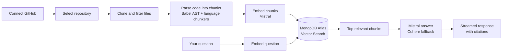

<div align="center">

# Codebase Copilot

**Understand any GitHub repository by asking questions about its code.**

Index a repo, ask in plain English, and get streamed answers with file and line citations, backed by vector search over the real source.

[Features](#features) · [How It Works](#how-it-works) · [Quick Start](#quick-start) · [Deploy to Render](#deploy-to-render) · [API Overview](#api-overview) · [Project Layout](#project-layout)

> **Live demo:** [codebase-copilot-mmzx.onrender.com/indexing](https://codebase-copilot-mmzx.onrender.com/indexing). It runs on Render's free tier, so the first load after a pause can take a while.

</div>

---

## Why Codebase Copilot?

Joining a new codebase, reviewing an unfamiliar PR, or auditing a dependency usually means hours of grepping and guessing. Codebase Copilot indexes the repository once, then lets you ask questions and jump straight to the exact code that backs each answer.

## Features

| | Feature | What you get |
| --- | --- | --- |
| 💬 | **Cited Q&A** | Streamed answers grounded in retrieved source, with file and line citations you can open. |
| 🔎 | **Code search and symbol tracing** | Find where things are defined and used across the repo. |
| 🕸️ | **Dependency graphs** | Visualize how modules relate to each other. |
| 🔀 | **PR review** | AI-assisted review of pull requests against the indexed codebase. |
| 📚 | **Onboarding docs** | Generate onboarding documentation for new contributors. |
| 🧩 | **Multi-repo chat** | Compare and query code across several repositories at once. |
| 👥 | **Teams** | Share repositories, invite members by email, and manage team admins. |
| 🔄 | **Auto-sync** | A GitHub webhook re-indexes the repo after every push. |
| 📈 | **Indexing status** | See exactly what has been indexed and how far along it is. |
| 🌐 | **Public explore** | Browse publicly shared repositories. |

## How It Works



1. **Connect:** sign in with GitHub and pick a repository.
2. **Index:** the backend clones it, skips generated assets and dependency folders, and extracts code chunks.
3. **Embed:** chunks get Mistral embeddings in batches and are stored in MongoDB.
4. **Ask:** each question is embedded, matched against chunks with Atlas Vector Search, and answered with streamed citations.

Supported source files are parsed for symbols. Files without extractable symbols can still be indexed as bounded whole-file chunks. Generated bundles and minified assets are excluded to keep retrieval focused on real source.

## Tech Stack

| Area | Stack |
| --- | --- |
| Frontend | React, Vite, Redux, Tailwind CSS |
| Backend | Node.js, Express, MongoDB, Mongoose |
| Code indexing | Babel AST parsing, language-specific chunkers, Mistral embeddings |
| Retrieval | MongoDB Atlas Vector Search |
| Assistant | Mistral, with Cohere as fallback |
| Integrations | GitHub OAuth, GitHub webhooks, SMTP email |

## Prerequisites

- Node.js **22.12** or newer
- MongoDB Atlas with **Vector Search** enabled
- A **Mistral** API key (embeddings and chat)
- A **Cohere** API key (chat fallback)
- A **GitHub OAuth app** for connecting repositories
- **SMTP** credentials for account verification, team OTPs, and invitations

## Quick Start

### 1. Clone and configure the backend

```bash
git clone <your-repo-url>
cd <your-repo>
```

Create `backend/.env`:

```env
PORT=3000
NODE_ENV=development
MONGO_URI=mongodb+srv://<user>:<password>@<cluster>/<database>
JWT_SECRET=<long-random-secret>
CORS_ORIGIN=http://localhost:5173
FRONTEND_URL=http://localhost:5173

GITHUB_CLIENT_ID=<github-oauth-client-id>
GITHUB_CLIENT_SECRET=<github-oauth-client-secret>
GITHUB_CALLBACK_URL=http://localhost:3000/api/github/callback

MISTRAL_API_KEY=<mistral-api-key>
COHERE_API_KEY=<cohere-api-key>
COHERE_MODEL=command-a-03-2025

SMTP_EMAIL=<smtp-email>
SMTP_APP_PASSWORD=<smtp-app-password>

# Required for GitHub push auto-sync; must be publicly reachable over HTTPS.
BACKEND_URL=https://<public-backend-host>
```

> The GitHub OAuth app's callback URL must match `GITHUB_CALLBACK_URL`. Auto-sync cannot deliver webhooks to `localhost`; use a deployed HTTPS backend or a public HTTPS tunnel.

### 2. Create the Atlas Vector Search index

On the `chunks` collection, create a Vector Search index named `chunk_vector_index`:

```json
{
  "fields": [
    {
      "type": "vector",
      "path": "embedding",
      "numDimensions": 1024,
      "similarity": "cosine"
    },
    {
      "type": "filter",
      "path": "repo"
    }
  ]
}
```

### 3. Run the app

In one terminal:

```bash
cd backend
npm install
npm run dev
```

In another:

```bash
cd frontend
npm install
npm run dev
```

Open [http://localhost:5173](http://localhost:5173). Vite proxies `/api` requests to the backend at `http://localhost:3000`.

## Deploy to Render

In production the backend serves the built frontend, so the whole app runs as a single Render web service on one origin.

**How it fits together**

- `npm run build` in `backend/` builds the frontend and copies its output to `backend/dist/public`.
- Express serves that folder as static files and falls back to `index.html` for client-side routes.
- Unknown `/api/*` routes return a JSON 404 instead of the frontend page.
- The frontend calls `/api/...` as a relative path, so no extra CORS setup is needed in production.

**Render service settings**

| Setting | Value |
| --- | --- |
| Environment | Node |
| Root directory | `backend` |
| Build command | `npm install && npm run build` |
| Start command | `npm start` |

Render still clones the whole repository, so the build script can reach `../frontend`. With a root directory set, commits that only touch `frontend/` do not auto-deploy; trigger a manual deploy for those.

**Environment variables:** copy everything from `backend/.env` into the Render dashboard, then update the URLs to your live domain:

```env
NODE_ENV=production
CORS_ORIGIN=https://<your-service>.onrender.com
FRONTEND_URL=https://<your-service>.onrender.com
BACKEND_URL=https://<your-service>.onrender.com
GITHUB_CALLBACK_URL=https://<your-service>.onrender.com/api/github/callback
```

**After the first deploy**

1. Update your GitHub OAuth app's callback URL to the new `GITHUB_CALLBACK_URL`.
2. Make sure your Atlas network access list allows Render's outbound IPs (or temporarily `0.0.0.0/0` while testing).
3. Connect a repository and push a commit to confirm webhook auto-sync works.

> Free Render instances sleep when idle, so the first request after a pause can take a while.

## API Overview

All routes are prefixed with `/api`.

| Route | Purpose |
| --- | --- |
| `/api/auth` | Sign up, verification, login, sessions |
| `/api/github` | GitHub OAuth and repository connection |
| `/api/repos` | Repository management, chunks, search, and analysis |
| `/api/multi-repo-chat` | Chat across multiple repositories |
| `/api/indexing` | Start and monitor repository indexing |
| `/api/settings` | User and app settings |
| `/api/history` | Chat and activity history |
| `/api/teams` | Teams, invitations, and admin management |
| `/api/webhooks` | GitHub push webhook receiver for auto-sync |
| `/api/explore` | Public repository exploration |

## Project Layout

```text
backend/
  src/
    controllers/   HTTP handlers
    dao/           MongoDB access
    models/        Mongoose schemas
    routes/        Express routes
    services/      Indexing, chat, teams, and integrations
    utils/         Chunking, embeddings, and shared utilities
  scripts/         Build helpers (frontend build + copy to dist/public)
frontend/
  src/
    App/           Routing and app state
    features/      Feature-specific components and services
    pages/         Application pages
```

## Development Checks

```bash
cd frontend
npm run lint
npm run build
```

The backend does not have an automated test suite yet.

## Security Notes

- Never commit `.env` files or credentials.
- Use a long, random `JWT_SECRET` in production.
- GitHub webhook auto-sync requires the connected GitHub account to have repository admin access.
- Team creation and joining use email OTPs that expire after 10 minutes.

## Roadmap

- [ ] Backend automated test suite

## Contributing

Issues and pull requests are welcome. For larger changes, open an issue first to discuss what you'd like to change.


